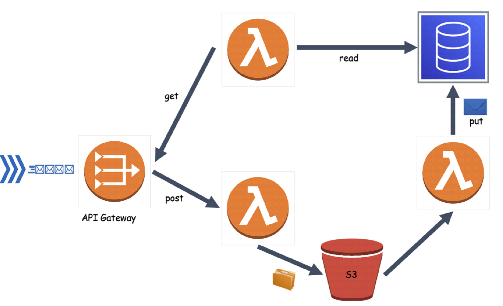
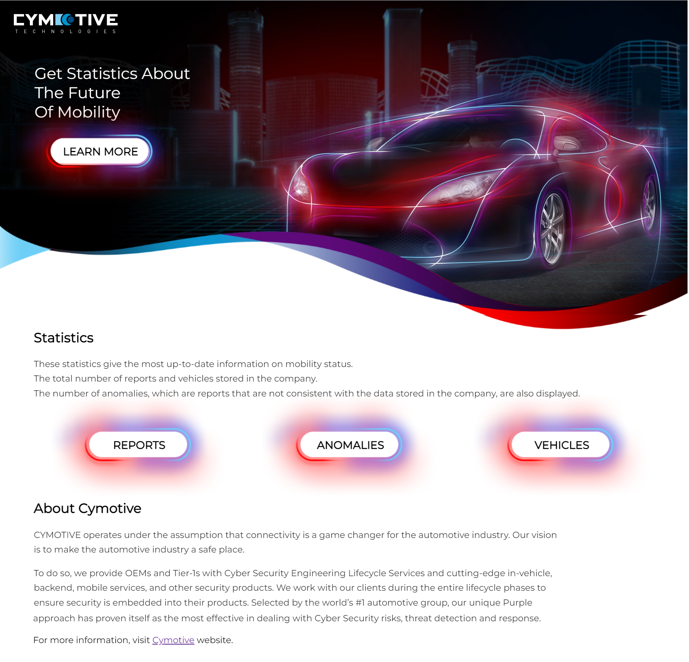

# Cymotive Challenge

This project is an Intrusion detection system (IDS) to detect anomalies in vehicles using AWS Cloud.  
In this project, I develop ETL (Extract, transform, load) data pipelines to gather data from a vehicle and put them into a single location to query and extract insights.

I used mock data of reports located in root dir called `reports.json`.

---

## AWS - Services

### S3 - cymotive-reports-bucket

Created S3 bucket to storage all the reports of anomalies.

### DynamoDB - ids-table

Created DynamoDB table for all the items from reports with `vehicleId` as primary key.

### Lambda - (Porter, Ingest, Analyzer)

#### 1. Porter  

Lambda function for dealing with http requests with report\s in json format and saving them in S3 bucket

#### 2. Ingest  

Lambda function that invoke every time a report is uploaded to S3 bucket., and ingesting the reports from S3 bucket to DynamoDB table `cymotiveTable`.

#### 3. Analyzer  

Lambda Function that connects http request to query data in `cymotiveTable`, can get Number of:

    1. Number of reports.
    2. Number of anomalies.
    3. Number of vehicle.

### API-Gateway - cymotiveApi

#### 1. Get all reports  

Allow to invoke lambda function through http requests.

<h3>end points</h3>

- <b>POST /</b> - send report\s in json format, invoke `porter`.

- <b>GET /numberofreports</b> - get number of reports, invoke `analyzer`.

- <b>GET /numberofanomalies</b> - get number of anomalies, invoke `analyzer`.

- <b>GET /numberofvehicles</b> - get number of vehicles, invoke `analyzer`.

---

## AWS-CDK

AWS-CDK allows me to upload a stack to `CloudFormation` using TS.  CloudFormation is not a simple service, but it is a powerful tool that allows you to create and manage your infrastructure.

CDK has the option to test templates and not to deal with zipping Lambda and other services. I've created all the AWS-Services above with CDK and not touched the Console, it helps to maintain the stack and let other devs work on the project.

### CloudFormation - template

Simple Template:

## 

## Front

Simple Front, Created with React to mobile and desktop.

---

## License

All the right reserved for [@Cymotive](https://www.cymotive.com/)
